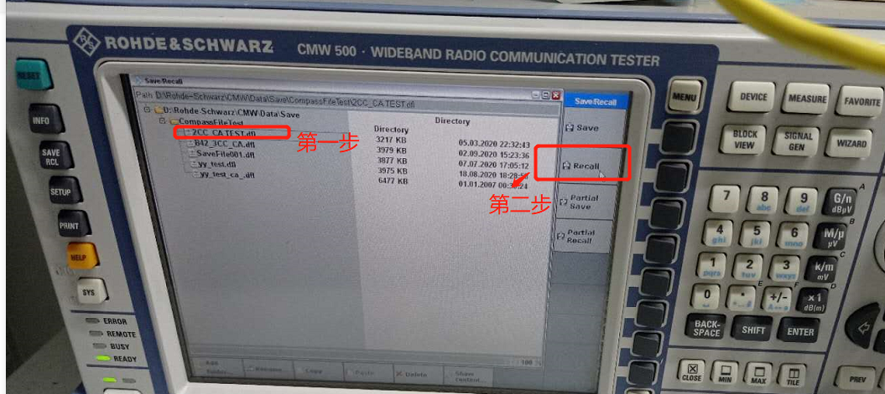
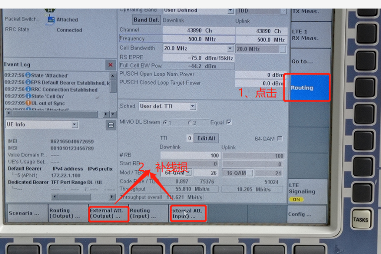
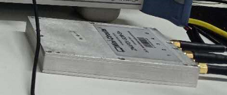
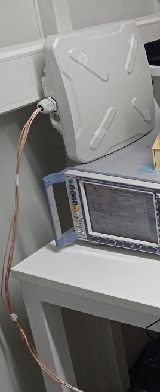
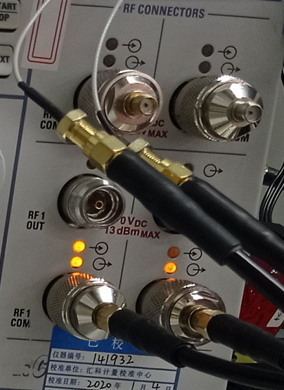
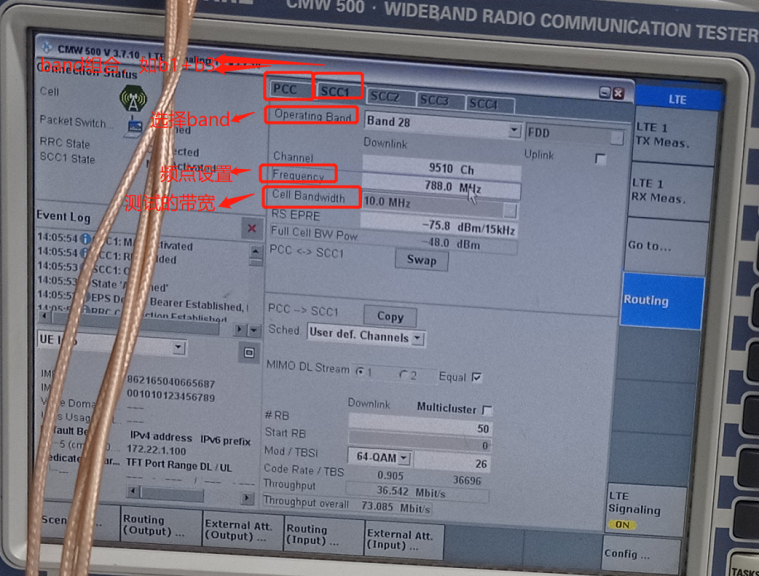
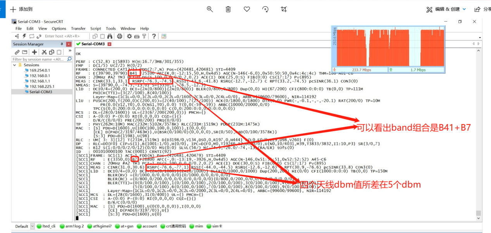

# cmw500_ca_test

## 开机

- 密码：123456

## SAVE RCL(调用配置)→选2CC_CA_TEST_dfl→Recall

## 补线损，根据接入的设备而定

## 天线接入规则

- RF com1 可接可收，其余可收
  
## 其他设置

## 截图

- crt串口log打开，输入q 2 ,  dou meter打开，新建停表，ftp打开连上仪表,从服务器下载到本地，停表点击开始，然后截图
  

